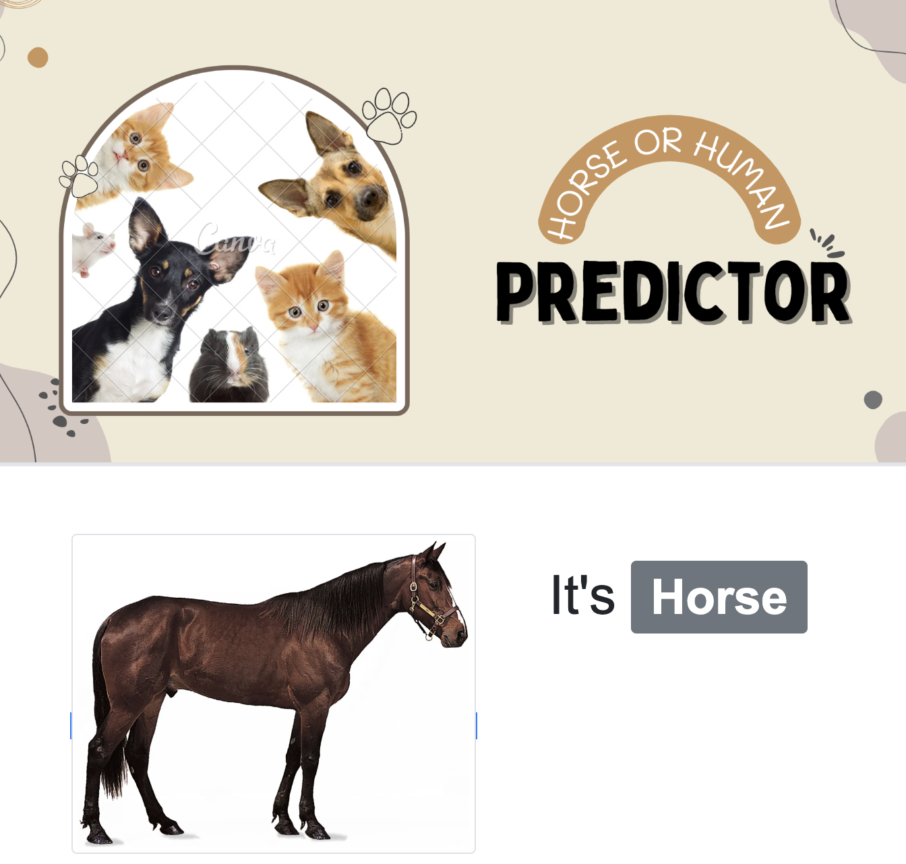

# Deep Learning Image Classification App - Human or Horse

**This is a deep learning application that uses a Convolutional Neural Network (CNN) algorithm to classify images as either human or horse. The app is built using the Python Flask framework and provides a web interface for users to upload images and receive predictions.**

## Getting Started

1. Clone the repository:
  git clone https://github.com/ripa01/Horse-or-Human.git

2. Change into the project directory:
  **cd Horse-or-Human**

3. Install the required dependencies:
   **pip install -r requirements.txt**

4. Start the Flask server:
   **flask run**

5. Open a web browser and go to **'http://localhost:5000'** to access the application.

## Usage

1.Open a web browser and go to http://localhost:5000 to access the application.

2.Upload an image by clicking on the "Upload Image" button.

3.Wait for the prediction result to be displayed, indicating whether the image contains a human or a horse.

## Model Training

The model used in this application is pre-trained. However, if you wish to train your own model or fine-tune the existing model, follow these steps:

1.Prepare your dataset with labeled images of humans and horses.

2. Split the dataset into training and validation sets.

3.Modify the model architecture or hyperparameters if necessary.

4.Train the model using the training dataset.

5.Evaluate the model using the validation dataset.

6.Save the trained model.

7.Replace the existing model file ('horse_or_human.h5') in the project directory with your trained model.

   
